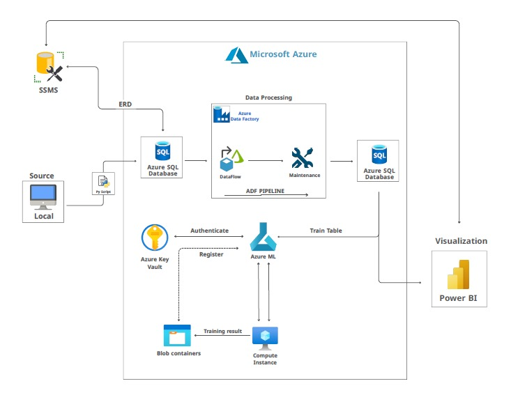

{
 "cells": [
  {
   "cell_type": "markdown",
   "id": "ba5b5a7f",
   "metadata": {},
   "source": [
    "# 🏠 Real Estate Data Analysis & Azure Pipeline Project\n"
   ]
  },
  {
   "cell_type": "markdown",
   "id": "869a6dc1",
   "metadata": {},
   "source": [
    "[](https://opensource.org/licenses/MIT) <!-- Placeholder: Replace with actual license if different -->\n",
    "[](https://example.com) <!-- Placeholder: Replace with actual build status link -->"
   ]
  },
  {
   "cell_type": "markdown",
   "id": "f8f8d175",
   "metadata": {},
   "source": [
    "## 🔍 Executive Summary\n",
    "\n",
    "\n"
   ]
  },
  {
   "cell_type": "markdown",
   "id": "ad9a4653",
   "metadata": {},
   "source": [
    "This project implements an end-to-end data analysis pipeline for real estate data, leveraging Microsoft Azure cloud services. It covers data ingestion from local sources to Azure SQL Database, data modeling using SSMS, transformation via Azure Data Factory dataflows, automated machine learning model training with Azure ML, and interactive visualization using Power BI. The goal is to extract actionable insights from real estate data through a robust and scalable cloud-based workflow.\n"
   ]
  },
  {
   "cell_type": "markdown",
   "id": "d50b5b66",
   "metadata": {},
   "source": [
    "------------------------------------------------------------------------\n"
   ]
  },
  {
   "cell_type": "markdown",
   "id": "eb5641a6",
   "metadata": {},
   "source": [
    "## 📖 Table of Contents\n"
   ]
  },
  {
   "cell_type": "markdown",
   "id": "1303477d",
   "metadata": {},
   "source": [
    "\n",
    "1.  [Project Objectives](#-project-objectives)\n",
    "2.  [Workflow Overview](#-workflow-overview)\n",
    "3.  [Dataset Overview](#-dataset-overview)\n",
    "4.  [Technologies & Tools](#-technologies--tools)\n",
    "5.  [Project Structure](#-project-structure)\n",
    "6.  [Setup Guide](#-setup-guide)\n",
    "7.  [Usage Instructions](#-usage-instructions)\n",
    "8.  [Team Roles](#-team-roles)\n",
    "9.  [Support & Contact](#-support--contact)\n",
    "10. [License](#-license)\n"
   ]
  },
  {
   "cell_type": "markdown",
   "id": "7d666b88",
   "metadata": {},
   "source": [
    "------------------------------------------------------------------------\n"
   ]
  },
  {
   "cell_type": "markdown",
   "id": "1697ca11",
   "metadata": {},
   "source": [
    "## 🏆 Project Objectives\n"
   ]
  },
  {
   "cell_type": "markdown",
   "id": "78f14e96",
   "metadata": {},
   "source": [
    "\n",
    "*   **Establish a Cloud-Based Data Pipeline:** Implement a full data workflow using Azure services (SQL DB, ADF, ML).\n",
    "*   **Data Ingestion & Modeling:** Securely upload local data to Azure SQL DB and define relationships using SSMS.\n",
    "*   **Data Transformation:** Clean, filter, and transform data using Azure Data Factory dataflows to create analysis-ready datasets.\n",
    "*   **Predictive Modeling:** Utilize Azure Automated ML to build and evaluate machine learning models based on the processed data.\n",
    "*   **Interactive Visualization:** Develop a Power BI dashboard connected to Azure SQL DB for insightful data exploration and reporting.\n",
    "*   **Provide Actionable Insights:** Deliver data-driven findings relevant to the real estate domain."
   ]
  },
  {
   "cell_type": "markdown",
   "id": "7e227b7f",
   "metadata": {},
   "source": [
    "------------------------------------------------------------------------"
   ]
  },
  {
   "cell_type": "markdown",
   "id": "d10f7468",
   "metadata": {},
   "source": [
    "## 🔄 Workflow Overview\n"
   ]
  },
  {
   "cell_type": "markdown",
   "id": "35c165f8",
   "metadata": {},
   "source": [
    "\n",
    "The project follows these key steps:\n",
    "\n",
    "1.  **Infrastructure Setup:** Provision Azure Server and Azure SQL Database.\n",
    "2.  **Data Ingestion:** Upload local data to Azure SQL DB via a Python script.\n",
    "3.  **Database Modeling (SSMS):** Design ERD and establish table relationships.\n",
    "4.  **Data Transformation (Azure Data Factory):**\n",
    "    *   Ingest data from Azure SQL DB.\n",
    "    *   Apply filters and transformations using ADF Dataflows.\n",
    "    *   Generate a new, processed table.\n",
    "5.  **Store Processed Data:** Save the transformed table back to Azure SQL Database.\n",
    "6.  **Machine Learning (Azure ML):**\n",
    "    *   Connect Azure ML to the processed data in Azure SQL DB.\n",
    "    *   Configure and run an Automated ML pipeline.\n",
    "7.  **Data Visualization (Power BI):**\n",
    "    *   Connect Power BI to the data in Azure SQL DB.\n",
    "    *   Create an interactive dashboard.\n",
    "    \n",
    "    \n",
    "\n"
   ]
  },
  {
   "cell_type": "markdown",
   "id": "9be59d58",
   "metadata": {},
   "source": [
    "------------------------------------------------------------------------"
   ]
  },
  {
   "cell_type": "markdown",
   "id": "2afc13db",
   "metadata": {},
   "source": [
    "## 📁 Dataset Overview\n"
   ]
  },
  {
   "cell_type": "markdown",
   "id": "10d89b54",
   "metadata": {},
   "source": [
    "\n",
    "*   **Source**: Primarily local CSV files (Agents, Clients, Properties, Sales, Visits) ingested into Azure SQL DB.\n",
    "*   **Domain**: Real Estate\n",
    "*   **Primary Attributes** (Examples - adapt based on actual data):\n",
    "    *   Property Details: Location, size, price, type\n",
    "    *   Sales Data: Transaction dates, prices, agent involved\n",
    "    *   Client/Agent Info: Contact details, interactions\n",
    "    *   Visit Data: Property visit logs, dates, feedback\n"
   ]
  },
  {
   "cell_type": "markdown",
   "id": "91b48a55",
   "metadata": {},
   "source": [
    "------------------------------------------------------------------------"
   ]
  },
  {
   "cell_type": "markdown",
   "id": "30c9edab",
   "metadata": {},
   "source": [
    "## 🛠 Technologies & Tools\n"
   ]
  },
  {
   "cell_type": "markdown",
   "id": "0438d1b2",
   "metadata": {},
   "source": [
    "\n",
    "| Functionality                  | Tools                                                               |\n",
    "| :----------------------------- | :------------------------------------------------------------------ |\n",
    "| **Cloud Platform**             | Microsoft Azure                                                     |\n",
    "| **Database**                   | Azure SQL Database, SQL Server Management Studio (SSMS)             |\n",
    "| **Data Integration & ETL**     | Azure Data Factory (Dataflows)                                      |\n",
    "| **Machine Learning**           | Azure Machine Learning (Automated ML), Python (Scikit-learn, Pandas) |\n",
    "| **Business Intelligence**      | Power BI                                                            |\n",
    "| **Scripting & Data Handling**  | Python (Pandas, Pyodbc or similar)                                  |\n",
    "| **Version Control**            | Git, GitHub "
   ]
  },
  {
   "cell_type": "markdown",
   "id": "64488a74",
   "metadata": {},
   "source": [
    "------------------------------------------------------------------------\n"
   ]
  },
  {
   "cell_type": "markdown",
   "id": "fbe330dd",
   "metadata": {},
   "source": [
    "## 🏗️ Project Structure\n"
   ]
  },
  {
   "cell_type": "markdown",
   "id": "1ec4d6d9",
   "metadata": {},
   "source": [
    "The repository is organized as follows:\n"
   ]
  },
  {
   "cell_type": "markdown",
   "id": "e311d0af",
   "metadata": {},
   "source": [
    "\n",
    "```\n",
    "├── config/               # Configuration files (e.g., config.json)\n",
    "├── data/\n",
    "│   └── raw/              # Original raw input data (CSV files)\n",
    "├── docs/                 # Documentation (presentation.pdf, info.txt, etc.)\n",
    "├── models/               # Trained ML models (model.pkl, MLmodel artifacts)\n",
    "├── reports/\n",
    "│   ├── dashboards/       # Power BI dashboards (dashboard.pbix)\n",
    "│   ├── figures/          # Images and diagrams (ERD.jpg, ML pipeline.jpg)\n",
    "│   └── performance/      # Model performance data (TSV files)\n",
    "├── src/\n",
    "│   ├── dataflow/         # Azure Data Factory related scripts/configs/exports\n",
    "│   ├── sql/              # SQL scripts (ERD.sql, table queries)\n",
    "│   └── import.py         # Python script for data ingestion to Azure SQL DB\n",
    "├── .gitignore            # Specifies intentionally untracked files\n",
    "├── conda.yaml            # Conda environment file (if used)\n",
    "├── python_env.yaml       # Python environment file (if used)\n",
    "├── requirements.txt      # Pip requirements file\n",
    "└── README.md             # This file\n",
    "```"
   ]
  },
  {
   "cell_type": "markdown",
   "id": "7b3e8ece",
   "metadata": {},
   "source": [
    "------------------------------------------------------------------------\n"
   ]
  },
  {
   "cell_type": "markdown",
   "id": "51af7ff5",
   "metadata": {},
   "source": [
    "## 🚀 Setup Guide\n"
   ]
  },
  {
   "cell_type": "markdown",
   "id": "cf0089c1",
   "metadata": {},
   "source": [
    "\n",
    "1.  **Clone the Repository:**\n",
    "    ```bash\n",
    "    git clone <your-repository-url>\n",
    "    cd <repository-name>\n",
    "    ```\n",
    "2.  **Azure Setup:**\n",
    "    *   Ensure you have an active Azure subscription.\n",
    "    *   Provision the necessary resources: Azure SQL Database, Azure Data Factory, Azure Machine Learning workspace.\n",
    "    *   Configure firewall rules and access permissions as needed.\n",
    "3.  **Configuration:**\n",
    "    *   Update connection strings and other parameters in `config/config.json` and relevant scripts (`src/import.py`, ADF linked services, etc.) to match your Azure environment.\n",
    "4.  **Environment Setup:**\n",
    "    *   Install required Python packages:\n",
    "        ```bash\n",
    "        pip install -r requirements.txt\n",
    "        ```\n",
    "    *   (Optional) If using Conda, create the environment:\n",
    "        ```bash\n",
    "        # conda env create -f conda.yaml\n",
    "        # conda activate <env-name>\n",
    "        ```\n"
   ]
  },
  {
   "cell_type": "markdown",
   "id": "7152ae51",
   "metadata": {},
   "source": [
    "------------------------------------------------------------------------\n"
   ]
  },
  {
   "cell_type": "markdown",
   "id": "a27e124a",
   "metadata": {},
   "source": [
    "## ▶️ Usage Instructions\n"
   ]
  },
  {
   "cell_type": "markdown",
   "id": "e274e99d",
   "metadata": {},
   "source": [
    "\n",
    "*   **Data Ingestion:** Run the Python script to upload data to Azure SQL DB:\n",
    "    ```bash\n",
    "    python src/import.py\n",
    "    ```\n",
    "*   **Data Transformation:** Trigger the appropriate pipeline/dataflow within your Azure Data Factory instance.\n",
    "*   **Machine Learning:** Navigate to your Azure ML workspace, locate the Automated ML experiment/pipeline, and run it.\n",
    "*   **Visualization:** Open the `dashboard.pbix` file located in `reports/dashboards/` using Power BI Desktop. Refresh the data connection to point to your Azure SQL Database.\n"
   ]
  },
  {
   "cell_type": "markdown",
   "id": "3276590f",
   "metadata": {},
   "source": [
    "------------------------------------------------------------------------\n"
   ]
  },
  {
   "cell_type": "markdown",
   "id": "48d39e30",
   "metadata": {},
   "source": [
    "## 👥 Team Roles\n"
   ]
  },
  {
   "cell_type": "markdown",
   "id": "d44deed9",
   "metadata": {},
   "source": [
    "\n",
    "Please fill in the roles, responsibilities, and LinkedIn profiles for each team member below:\n",
    "\n",
    "| Name           | Role                      | Responsibilities                                              | LinkedIn Profile |\n",
    "| :------------- | :------------------------ | :------------------------------------------------------------ | :--------------- |\n",
    "| Sayed Elmasry  | Azure & ML Engineer       | Azure Infrastructure Setup, Machine Learning Implementation and Deployment | [Sayed Elmasry](https://www.linkedin.com/in/sayed-elmasry) |\n",
    "| Verina Fouad   | SQL & Power BI Developer  | SQL Development, Power BI Dashboard Design and Theming        | [Verina Fouad](https://www.linkedin.com/in/verina-fouad-06270217a?utm_source=share&utm_campaign=share_via&utm_content=profile&utm_medium=android_app) |\n",
    "| Mai Mamdooh    | Power BI Analyst/Developer | Power BI Analysis, Dashboard Creation, Presentations          | [Mai Mamdooh](https://www.linkedin.com/in/mai-mamdooh?utm_source=share&utm_campaign=share_via&utm_content=profile&utm_medium=android_app) |\n",
    "| Naira ELazab   | SQL Analyst               | Writing and optimizing SQL queries, Data Analysis, Presentations | [Naira ELazab](https://www.linkedin.com/in/naira-elazab/) |\n",
    "| Rewan Gamal    | Power BI Analyst          | Power BI Data Modeling, Visualization, and Analysis            | [Rewan Gamal](https://www.linkedin.com/in/rewan-gamal-870964192?utm_source=share&utm_campaign=share_via&utm_content=profile&utm_medium=android_app) |\n",
    "| Zaineb Elghoul | SQL Developer             | SQL Scripting, Query Optimization, Data Preparation            | [Zaineb Elghoul](https://www.linkedin.com/in/zaineb-elghoul-3711a7173?utm_source=share&utm_campaign=share_via&utm_content=profile&utm_medium=android_app) |\n",
    "| Nermin Reda    | Documentation Specialist  | Project Documentation, Reporting, and Workflow Tracking        | [Nermin Reda](https://www.linkedin.com/in/nermin-reda-97798524a/) |\n",
    "\n"
   ]
  },
  {
   "cell_type": "markdown",
   "id": "61875c23",
   "metadata": {},
   "source": [
    "------------------------------------------------------------------------"
   ]
  },
  {
   "cell_type": "markdown",
   "id": "331a3284",
   "metadata": {},
   "source": [
    "## 📞 Support & Contact\n"
   ]
  },
  {
   "cell_type": "markdown",
   "id": "302115b4",
   "metadata": {},
   "source": [
    "\n",
    "For questions, issues, or suggestions regarding this project, please use the following channels:\n",
    "\n",
    "*   **Primary Contact:** [Your Name / Lead Name] - [your.email@example.com]\n",
    "*   **Issue Tracker:** [Link to GitHub Issues for the repository]\n",
    "*   **Project Channel:** [Link to relevant Slack/Teams channel, if applicable]\n",
    "\n",
    "*(Please update contact details and links)*"
   ]
  },
  {
   "cell_type": "markdown",
   "id": "24033ae7",
   "metadata": {},
   "source": [
    "------------------------------------------------------------------------\n"
   ]
  },
  {
   "cell_type": "markdown",
   "id": "bebff7ec",
   "metadata": {},
   "source": [
    "## 📜 License\n"
   ]
  },
  {
   "cell_type": "markdown",
   "id": "2e07a0dc",
   "metadata": {},
   "source": [
    "[]()\n",
    "[]() "
   ]
  },
  {
   "cell_type": "markdown",
   "id": "ab24ad55",
   "metadata": {},
   "source": [
    "\n",
    "This project is licensed under the MIT License. See the `LICENSE` file for details. (Ensure a LICENSE file exists or specify the license directly).\n"
   ]
  },
  {
   "cell_type": "markdown",
   "id": "d90a9d41",
   "metadata": {},
   "source": [
    "------------------------------------------------------------------------\n"
   ]
  }
 ],
 "metadata": {
  "language_info": {
   "name": "python"
  }
 },
 "nbformat": 4,
 "nbformat_minor": 5
}
